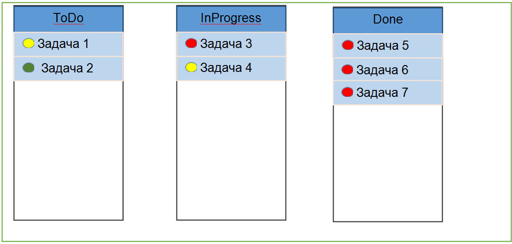

## Description task

Реализовать WEB-интерфейс статичной SCRUM доски. 
Отобразить три колонки карточек: 
- «К выполнению»,
- «В процессе», 
- «Завершено». 

В каждой колонке показывать карточки, состояние которых соответствует данной колонке. Предусмотреть сортировку карточек по дате создания, либо по приоритету. Карточки должны сохраняться и извлекаться из хранилища Redux. Редактирование, перетаскивание карточек реализовывать не требуется. В качестве входных данных использовать произвольный массив JSON.

Требования:
- Использовать ReactJs (плюсом будет использование хуков)
- Хранить карточки в Redux
- Использовать TypeScript
- Использовать элементы дизайна Material-UI https://material-ui.com

Сущности:
	Card: {
		id: number,
		label: string,
		text: string,
		priority: number,
		createDate: Date,
  }

This project was bootstrapped with [Create React App](https://github.com/facebook/create-react-app).

## Available Scripts

In the project directory, you can run:

`npm install`

`npm start`
